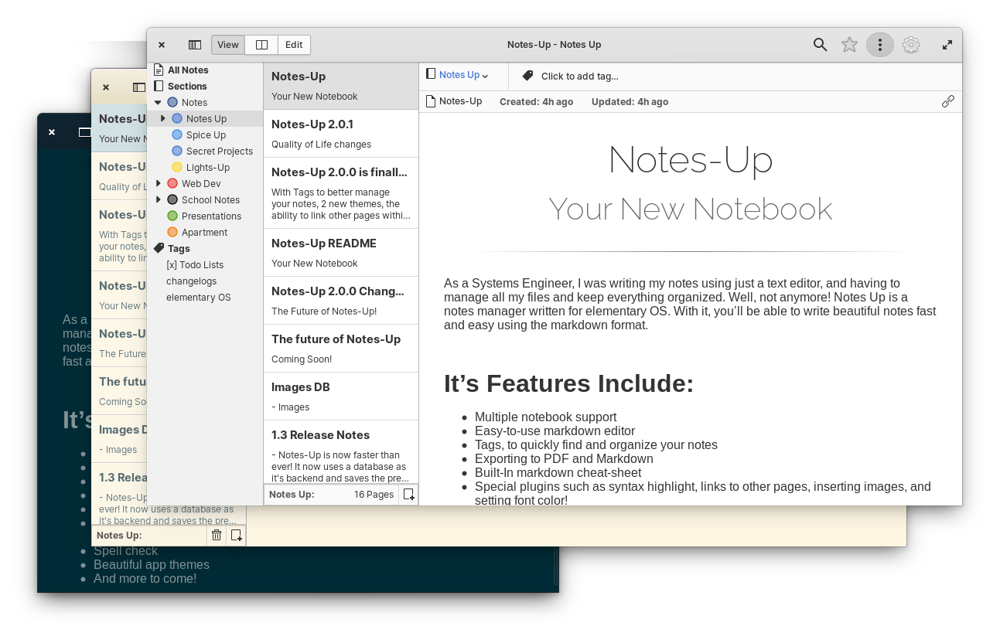

<div>
  <h1 align="center">Notes-Up</h1>
  <h3 align="center">Write beautiful notes fast and easy using Markdown</h3>
</div>

<br/>

<p align="center">
  <a href="https://appcenter.elementary.io/com.github.philip-scott.notes-up">
    
  </a>
</p>

<br/>

<p align="center">
    
</p>

<h2> </h2>

As a computer engineer, I've been writing my school notes using just a text editor, and having to manage all my files and keep everything organized. Well, not anymore! **Notes Up** is a notes manager written for elementary OS. With it, you'll be able to write beautiful notes fast and easy using the markdown format.

### It's Features Include:

- Multiple notebook support
- Easy-to-use markdown editor
- Exporting to PDF
- And more to come!

## New in 1.3.1!

- A help section has been added to the editing view. Simply click on the question mark on the top-right and you'll see a list with the markdown format! (Try clicking on the code)
- You can now keep your notebook list open while editing. Available right from the settings!
- Plugins! One more plugin has been added to the family!
	- **Highlight**: By using it just once in your document, you'll enable syntax highlighting! Just type  ` <highlight>` and your code blocks will be given some style! You just need to add the language you're using like ` ```vala `
- Clicking on the image button on the toolbar without anything selected now embeds the image with your document! Now you don't have to worry about moving files! You can still link images by dragging and dropping them into the editor
- Changed: the New Page shortcut has been changed from `Ctrl+N` to `Ctrl+Shift+N` to avoid accidentally creating new pages when you didn't want to
- Preparations for AppCenter!

You can also view the full [changelog here](changelog.md)

## Donations
If you liked _Notes-up_, and would like to support it's development of this app and more, consider [buying me a coffee](https://www.paypal.com/cgi-bin/webscr?cmd=_s-xclick&hosted_button_id=WYD9ZJK6ZFUDQ) :)

## Installation:
[](https://appcenter.elementary.io/com.github.philip-scott.notes-up)

On elementary OS? Hit the button to get Notes-Up!

#### Not on elementary?
You can install Notes-Up from a PPA. But be aware that your results may vary

PPA: _ppa:philip.scott/notes-up_

	sudo add-apt-repository ppa:philip.scott/notes-up
	sudo apt-get update
	sudo apt-get install com.github.philip-scott.notes-up

If you were using the previous version of Notes-up, **you will need to add this new PPA**. This version changes how files are saved on your computer, so it won't be given automatically to the previous users. No worries though, your old files will be imported when you first run the app!

Notes-Up is also available for [openSUSE](https://software.opensuse.org/package/notes-up).

## How To Build
For advanced users!

	git clone https://github.com/Philip-Scott/Notes-up
	cd Notes-up
	mkdir build && cd build
	cmake -DCMAKE_INSTALL_PREFIX=/usr ../
	sudo make install

If you are building on a distribution which is not elementary, you need to add `-Dnoele=1` when running cmake.
